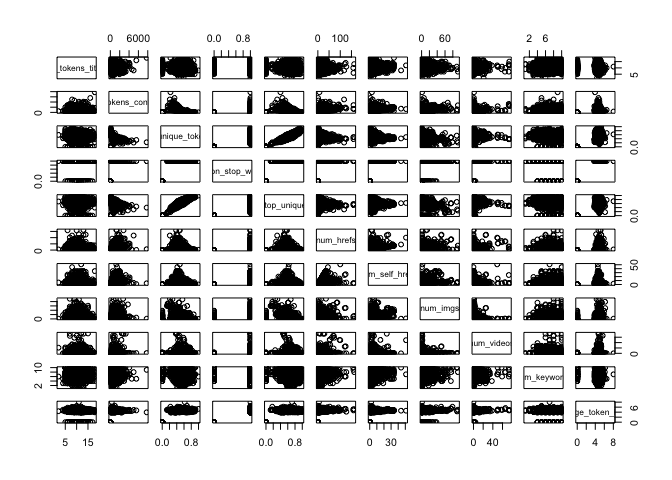
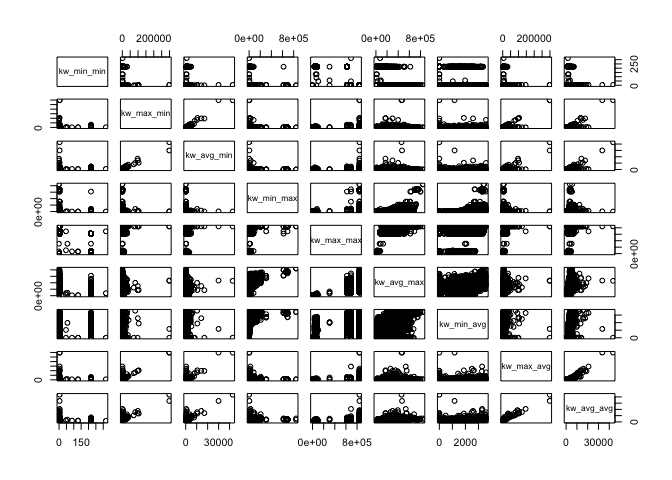
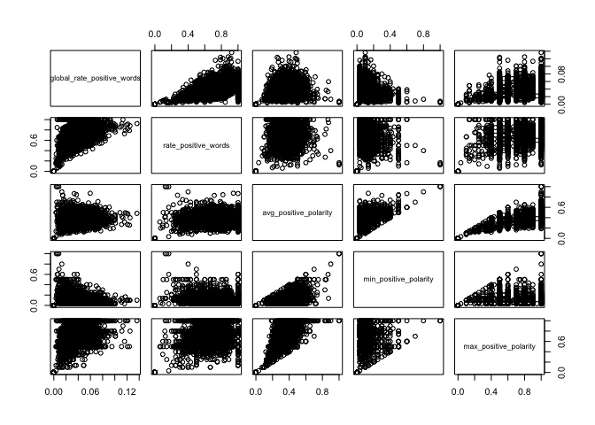
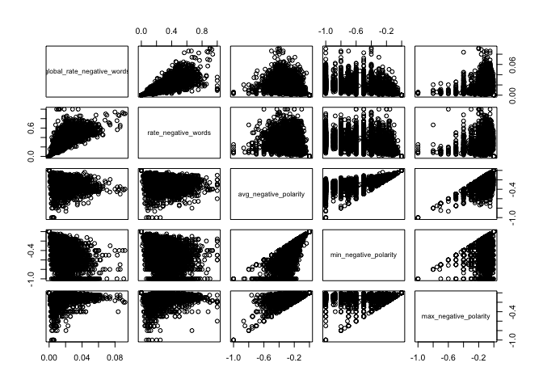

Project 2: Monday Data
======================

Introduction:
-------------

In this project I will be using the `OnlineNewsPopularity.csv` data, which is a data set about various articles that are published along with various article and publishing attributes. The goal of this project is to accurately predict the number of times that a particular article will be "shared" on social media given its attributes.

The data set contains articles that are published on all 7 days of the week. In this report, I will *only* be considering articles that were published on a **Monday**. In order to predict the number of shares, I will first build a Linear Regression model and then a Random Forest model on training data. I will then compare the performance of both on a test data set and select the final predictive model.

Data Summary
------------

Overall, the Online News Popularity data has *39644* observations and *62* variables. There are a total of *6661* observations for articles that were published on a Monday, and that is the subset of observations that I will be using for this report. From the initial variables, I will be considering *46* of them as potentially having an effect on number of shares.

There are 5 groups of variables that have similar themes in this data set. The variables within each group likely have high correlations with each other. The variable groups are about:

1.  Number of words/keywords/media

2.  Digital channel type

3.  Shares by keyword

4.  Typical shares of articles in Mashable

5.  Sentiment and Polarity

**Correlation Plots for Number of Word Variables:**

As seen below, many of the variables are highly correlated and might need to be removed.

**Data Channel Type:**

A correlation plot of the data channel variables shows that each of them is mutually exclusive and therefore can be combined into one categorical variable.

    ## entertainment      business          tech     lifestyle         world 
    ##          1358          1153          1235           322          2256 
    ##  social media 
    ##           337

**Shares by Keyword Variables:**

As seen below, many of the variables seem correlated and might need to be removed.

**Mashable Shares Variables:**

These variables seem to have very similar distributions. It is not clear whether there will be any relationship with overall shares.

**Sentiment/Polarity Variables:** 
