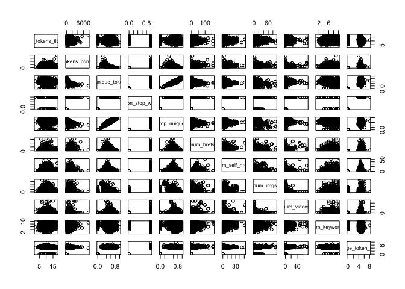

Project 2: Monday Data
======================

Introduction:
-------------

In this project I will be using the `OnlineNewsPopularity.csv` data, which is a data set about various articles that are published along with various article and publishing attributes. The goal of this project is to accurately predict the number of times that a particular article will be "shared" on social media given its attributes.

The data set contains articles that are published on all 7 days of the week. In this report, I will *only* be considering articles that were published on a **Monday**. In order to predict the number of shares, I will first build a Linear Regression model and then a Random Forest model on training data. I will then compare the performance of both on a test data set and select the final predictive model.

Data Summary
------------

Overall, the Online News Popularity data has *39644* observations and *62* variables. There are a total of *6661* observations for articles that were published on a Monday, and that is the subset of observations that I will be using for this report. From the initial variables, I will be considering *46* of them as potentially having an effect on number of shares.

There are 5 groups of variables that have similar themes in this data set. The variables within each group likely have high correlations with each other. The variable groups are about:

1.  Number of words/keywords/media

2.  Digital channel type

3.  Shares by keyword

4.  Typical shares of articles in Mashable

5.  Sentiment and Polarity

**Correlation Plots for Number of Word Variables:**

As seen below, many of the variables are highly correlated and might need to be removed.



**Data Channel Type:**

A correlation plot of the data channel variables shows that each of them is mutually exclusive and therefore can be considered dummy variables for one categorical variable.

**Shares by Keyword Variables:**

As seen below, many of the variables seem correlated and might need to be removed.


**Mashable Shares Variables:**

These variables seem to have very similar distributions. It is not clear whether there will be any relationship with overall shares.


**Sentiment/Polarity Variables:**

When comparing variables measuring positive and negative polarities, there seems to be moderate to strong correlations.


Modeling
--------

First, I will split the data into training and test sets. The training data set will contain 70% of the data observations, and the test set will contain the remaining 30%.

Dimensions of the train and test sets:

    ## [1] 4662   46

    ## [1] 1999   46

### Linear Model

I will first begin by fitting a linear regression model with ALL of the variables.

Here is the summary of the first linear model. Looking at the t statistics and p-values, the majority of predictors are not statistically significant for predicting shares. The model overall is statistically significant, but has an incredibly low adjusted-R<sup>2</sup> value (0.0239).

    ## 
    ## Call:
    ## lm(formula = shares ~ ., data = dTrain)
    ## 
    ## Residuals:
    ##    Min     1Q Median     3Q    Max 
    ## -18168  -2815  -1303    196 678534 
    ## 
    ## Coefficients:
    ##                                 Estimate Std. Error t value Pr(>|t|)    
    ## (Intercept)                   -6.677e+02  2.529e+03  -0.264  0.79175    
    ## n_tokens_title                 1.227e+02  1.010e+02   1.215  0.22461    
    ## n_tokens_content              -4.820e-01  7.711e-01  -0.625  0.53199    
    ## n_unique_tokens               -3.279e+03  6.649e+03  -0.493  0.62194    
    ## n_non_stop_words              -3.348e+03  1.455e+04  -0.230  0.81803    
    ## n_non_stop_unique_tokens       5.954e+03  5.670e+03   1.050  0.29377    
    ## num_hrefs                      1.431e+01  2.381e+01   0.601  0.54798    
    ## num_self_hrefs                 7.272e+01  6.452e+01   1.127  0.25977    
    ## num_imgs                       1.105e+01  3.132e+01   0.353  0.72419    
    ## num_videos                     7.748e+01  4.954e+01   1.564  0.11789    
    ## average_token_length          -5.382e+02  8.397e+02  -0.641  0.52163    
    ## num_keywords                   3.906e+01  1.299e+02   0.301  0.76369    
    ## data_channel_is_lifestyle     -5.476e+02  1.199e+03  -0.457  0.64788    
    ## data_channel_is_entertainment -2.336e+03  8.629e+02  -2.707  0.00682 ** 
    ## data_channel_is_bus           -6.647e+02  9.378e+02  -0.709  0.47848    
    ## data_channel_is_socmed        -1.522e+03  1.166e+03  -1.306  0.19176    
    ## data_channel_is_tech          -1.540e+03  9.400e+02  -1.638  0.10150    
    ## data_channel_is_world         -1.393e+03  1.001e+03  -1.392  0.16399    
    ## kw_min_min                    -1.300e+01  4.766e+00  -2.728  0.00640 ** 
    ## kw_max_min                     1.388e-02  1.451e-01   0.096  0.92379    
    ## kw_avg_min                     4.463e-01  1.040e+00   0.429  0.66779    
    ## kw_min_max                    -2.915e-03  4.537e-03  -0.643  0.52052    
    ## kw_max_max                    -3.148e-03  1.703e-03  -1.848  0.06466 .  
    ## kw_avg_max                    -5.798e-03  2.863e-03  -2.025  0.04291 *  
    ## kw_min_avg                    -4.063e-01  2.644e-01  -1.537  0.12443    
    ## kw_max_avg                    -3.817e-01  8.242e-02  -4.632 3.72e-06 ***
    ## kw_avg_avg                     2.911e+00  4.854e-01   5.996 2.18e-09 ***
    ## self_reference_min_shares      5.413e-03  2.949e-02   0.184  0.85436    
    ## self_reference_max_shares     -3.064e-03  1.905e-02  -0.161  0.87225    
    ## self_reference_avg_sharess     1.108e-02  4.483e-02   0.247  0.80487    
    ## global_subjectivity            3.370e+03  2.957e+03   1.140  0.25453    
    ## global_sentiment_polarity     -4.936e+03  5.852e+03  -0.844  0.39899    
    ## global_rate_positive_words     6.749e+00  2.604e+04   0.000  0.99979    
    ## global_rate_negative_words    -3.215e+04  4.924e+04  -0.653  0.51387    
    ## rate_positive_words            2.815e+03  1.381e+04   0.204  0.83853    
    ## rate_negative_words            1.744e+03  1.405e+04   0.124  0.90121    
    ## avg_positive_polarity          6.152e+03  4.697e+03   1.310  0.19030    
    ## min_positive_polarity         -8.680e+03  4.057e+03  -2.140  0.03243 *  
    ## max_positive_polarity         -1.200e+03  1.510e+03  -0.794  0.42699    
    ## avg_negative_polarity          2.516e+03  4.368e+03   0.576  0.56473    
    ## min_negative_polarity         -2.155e+03  1.616e+03  -1.333  0.18247    
    ## max_negative_polarity         -2.519e+03  3.688e+03  -0.683  0.49473    
    ## title_subjectivity            -3.981e+02  9.582e+02  -0.415  0.67783    
    ## title_sentiment_polarity       5.086e+02  8.769e+02   0.580  0.56193    
    ## abs_title_subjectivity         1.901e+03  1.274e+03   1.492  0.13588    
    ## abs_title_sentiment_polarity   2.028e+03  1.371e+03   1.479  0.13925    
    ## ---
    ## Signif. codes:  0 '***' 0.001 '**' 0.01 '*' 0.05 '.' 0.1 ' ' 1
    ## 
    ## Residual standard error: 13670 on 4616 degrees of freedom
    ## Multiple R-squared:  0.03334,    Adjusted R-squared:  0.02392 
    ## F-statistic: 3.538 on 45 and 4616 DF,  p-value: 2.317e-14

I will now update the linear regression model, only including the statistically significant predictors. Hopefully this will increase the predictivity of the model.

    ## 
    ## Call:
    ## lm(formula = shares ~ data_channel_is_entertainment + kw_min_min + 
    ##     kw_max_max + kw_avg_max + kw_max_avg + kw_avg_avg + min_positive_polarity, 
    ##     data = dTrain)
    ## 
    ## Residuals:
    ##    Min     1Q Median     3Q    Max 
    ## -22314  -2769  -1494   -110 681189 
    ## 
    ## Coefficients:
    ##                                 Estimate Std. Error t value Pr(>|t|)    
    ## (Intercept)                    1.621e+03  1.241e+03   1.306  0.19160    
    ## data_channel_is_entertainment -1.064e+03  5.081e+02  -2.095  0.03625 *  
    ## kw_min_min                    -1.253e+01  4.640e+00  -2.701  0.00694 ** 
    ## kw_max_max                    -3.535e-03  1.568e-03  -2.255  0.02419 *  
    ## kw_avg_max                    -5.764e-03  2.131e-03  -2.705  0.00685 ** 
    ## kw_max_avg                    -3.170e-01  4.843e-02  -6.545 6.59e-11 ***
    ## kw_avg_avg                     2.908e+00  3.046e-01   9.547  < 2e-16 ***
    ## min_positive_polarity         -4.248e+03  2.906e+03  -1.462  0.14386    
    ## ---
    ## Signif. codes:  0 '***' 0.001 '**' 0.01 '*' 0.05 '.' 0.1 ' ' 1
    ## 
    ## Residual standard error: 13680 on 4654 degrees of freedom
    ## Multiple R-squared:  0.02467,    Adjusted R-squared:  0.02321 
    ## F-statistic: 16.82 on 7 and 4654 DF,  p-value: < 2.2e-16


    ## 1362 
    ## 1362

    ## 
    ## Call:
    ## lm(formula = shares ~ data_channel_is_entertainment + kw_min_min + 
    ##     kw_max_max + kw_avg_max + kw_max_avg + kw_avg_avg + min_positive_polarity, 
    ##     data = dTrain, weights = as.numeric(w))
    ## 
    ## Weighted Residuals:
    ##    Min     1Q Median     3Q    Max 
    ##  -6080  -1648   -981      0  40958 
    ## 
    ## Coefficients:
    ##                                 Estimate Std. Error t value Pr(>|t|)    
    ## (Intercept)                    1.276e+03  3.488e+02   3.657 0.000258 ***
    ## data_channel_is_entertainment -7.874e+02  1.427e+02  -5.516 3.66e-08 ***
    ## kw_min_min                    -3.797e+00  1.304e+00  -2.912 0.003604 ** 
    ## kw_max_max                    -1.023e-03  4.409e-04  -2.320 0.020369 *  
    ## kw_avg_max                    -2.642e-03  6.064e-04  -4.357 1.35e-05 ***
    ## kw_max_avg                    -1.413e-01  1.961e-02  -7.205 6.78e-13 ***
    ## kw_avg_avg                     1.313e+00  9.239e-02  14.207  < 2e-16 ***
    ## min_positive_polarity         -7.733e+02  8.157e+02  -0.948 0.343202    
    ## ---
    ## Signif. codes:  0 '***' 0.001 '**' 0.01 '*' 0.05 '.' 0.1 ' ' 1
    ## 
    ## Residual standard error: 3810 on 4586 degrees of freedom
    ## Multiple R-squared:  0.05922,    Adjusted R-squared:  0.05778 
    ## F-statistic: 41.24 on 7 and 4586 DF,  p-value: < 2.2e-16


### Non-Linear Model

Regression Tree

``` r
set.seed(100)
trctrl <- trainControl(method="repeatedcv", number=10)

tree_fit <- train(shares ~., data = dTrain, method = "rpart", trControl = trctrl,
                 preProcess = c("center", "scale") )
```

    ## Warning in nominalTrainWorkflow(x = x, y = y, wts = weights, info = trainInfo, :
    ## There were missing values in resampled performance measures.

I will fit the bagged tree with the code below. The method is specified to `treebag`.

``` r
bag_fit <- train(shares ~., data = dTrain, method = "treebag", trControl = trctrl,
                 preProcess = c("center", "scale") )
```
